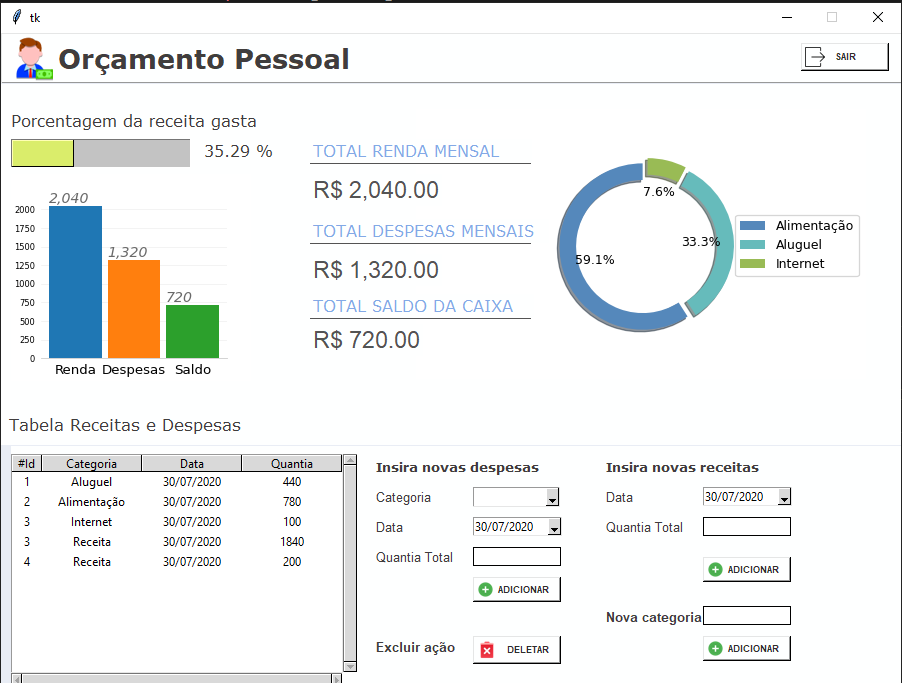

# Projeto de Orçamento Pessoal

Este projeto é uma aplicação de interface gráfica construída com Tkinter para gerenciar receitas e despesas pessoais. A aplicação permite inserir e visualizar categorias de despesas, receitas e um resumo financeiro, além de exibir gráficos para facilitar a compreensão dos dados.



## Funcionalidades

- Inserir categorias de despesas.
- Inserir e visualizar receitas.
- Inserir e visualizar despesas.
- Exibir a percentagem de receitas gastas.
- Exibir gráficos de barras e de pizza para visualização dos dados financeiros.
- Resumo total de receitas, despesas e saldo.
- Deletar entradas da tabela de receitas e despesas.

## Tecnologias Utilizadas

- Python 3.12
- Tkinter
- Matplotlib
- Pillow
- Tkcalendar

## Estrutura do Projeto

- **`main.py`**: Contém a lógica principal e a interface gráfica.
- **`view.py`**: Contém as funções de backend para manipulação dos dados.

## Configuração do Ambiente

1. Clone o repositório:

    ```bash
    git clone https://github.com/seu-usuario/projeto-orcamento-pessoal.git
    ```

2. Navegue até o diretório do projeto:

    ```bash
    cd projeto-orcamento-pessoal
    ```

3. Crie um ambiente virtual:

    ```bash
    python -m venv venv
    ```

4. Ative o ambiente virtual:

    - No Windows:

        ```bash
        venv\Scripts\activate
        ```

    - No MacOS/Linux:

        ```bash
        source venv/bin/activate
        ```

5. Instale as dependências:

    ```bash
    pip install -r requirements.txt
    ```

## Execução

Para executar a aplicação, use o seguinte comando:

```bash
python main.py

## Uso

### Inserir Categorias de Despesas
1. No campo "Nova categoria ", digite o nome da categoria.
2. Clique no botão "Adicionar".

### Inserir Receitas
1. No campo "Insira novas receitas", selecione a data.
2. Insira a quantia total.
3. Clique no botão "Adicionar".

### Inserir Despesas
1. No campo "Insira novas despesas", selecione a categoria.
2. Selecione a data.
3. Insira a quantia total.
4. Clique no botão "Adicionar".

### Deletar Entradas
1. Selecione a entrada na tabela.
2. Clique no botão "Deletar".


## Documentação Adicional

Para mais detalhes sobre o funcionamento do código e as análises realizadas, consulte o arquivo `main.py` e os scripts adicionais no diretório do projeto.

---

### Licença

Este projeto está licenciado sob a Licença MIT - veja o arquivo [LICENSE](LICENSE) para mais detalhes.

### Como Contribuir

Fique à vontade para contribuir com novas funcionalidades, melhorias de código ou correções de bugs. Sinta-se livre para abrir uma issue ou enviar um pull request.

---

🔗 **Mantenha-se Conectado:**

- [LinkedIn](https://www.linkedin.com/in/larissa-silva-93452911b)

